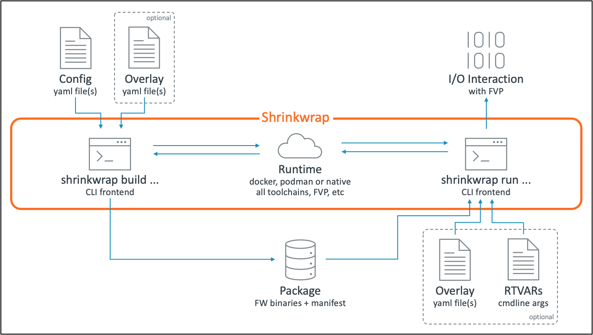

..
 # Copyright (c) 2022,2023, Arm Limited.
 #
 # SPDX-License-Identifier: MIT

########
Overview
########

************
Introduction
************

Shrinkwrap is a tool to simplify the process of building and running firmware on
Arm Fixed Virtual Platforms (FVP). It provides a number of configurations that
can be used out-of-the-box as well as enabling users to compose and extend them
in a manner that can be easily shared and reused. No more shall engineers have
to fight with inexplicable fragments of hand-me-down bash code or endlessly
search for FVP command line parameters!

Shrinkwrap focuses on building FW stacks and configuring the FVP for a desired
set of architecture features so that all components are consistent. Engineers
bring their own kernel and rootfs to run on top of this foundation.

Shrinkwrap provides an intuative command line interface frontend and (by
default) a container-based backend so users don't have to think about the
tools required to build or run their configs. Everything is also transparent;
users can discover every single invoked command with the ``--dry-run`` option.

Configs are defined in YAML and can easily be composed and extended using the
built-in layering system.

See :ref:`userguide/quickstart:Quick Start Guide` to get up and running.

********
Features
********

- A simple and intuitive command line interface enables:

  - Acquire and build all required firmware components for a given configuration
  - Package built firmware components for easy distribution
  - Configure and boot the FVP with the packaged firmware components

- Introspect and use any of the supplied the out-of-box configurations
- Create your own configurations by composing with and extending others
- Choose from Docker or Podman runtime backends or run everything natively if
  you prefer
- Ensure Reproducible builds with supplied runtime container images
- Transparently view the generated bash commands for a given config build or run
- Parallelize builds to make best use of available resources
- Acquire source from Git remote or point to existing Git local repo
- Easily switch between all Arm architecture extensions v8.0 - v9.x.

************
Architecture
************

Shrinkwrap is implemented in Python and has a command line interface similar to
git, with sub-commands that take options. The Python code parses the supplied
config(s) to generate shell commands that are executed in a backend runtime. The
runtime is specified by the user and may be ``null`` (executed natively on the
user's system), or a container runtime such as ``docker`` or ``podman``. For the
container runtimes, a standard image is provided with all tools preinstalled.

The command line interface has 2 main commands; build and run. The build command
takes a configuration (a yaml file) along with an optional overlay which tweaks
settings in the config, then builds and packages all the components described
within. The package could optionally be distributed for use by others. The run
command launches the built package on the FVP, allowing the user to interact
with it. The definition of how to run the FVP is contained in the original
config that was supplied at build time and is included in the package. The run
command allows further tweaking of this runtime config with another optional
overlay. The user can also optionally provide values for any runtime variables
(RTVARs) that are defined as part of the config. These are typically used to
point to the kernel or rootfs that should be used.

********************
Repository Structure
********************

=================== ====
Directory           Description
=================== ====
./config            Shrinkwrap standard config store.
./docker            Scripts to generate docker images used by shrinkwrap's
                    container runtimes.
./documentation     Source for this documentation.
./shrinkwrap        Shrinkwrap Python tool implementation.
./test              Automated tests.
=================== ====

******************
Repository License
******************

The software is provided under an MIT license (more details in
:ref:`license_file_link:License`).

Contributions to the project should follow the same license.

*****************************
Contributions and Bug Reports
*****************************

Contributions are accepted under the MIT license. Only submit contributions
where you have authored all of the code.

If you're hitting an error/bug and need help, it's best to raise an issue in
GitLab.

*************
Maintainer(s)
*************

- Ryan Roberts <ryan.roberts@arm.com>
